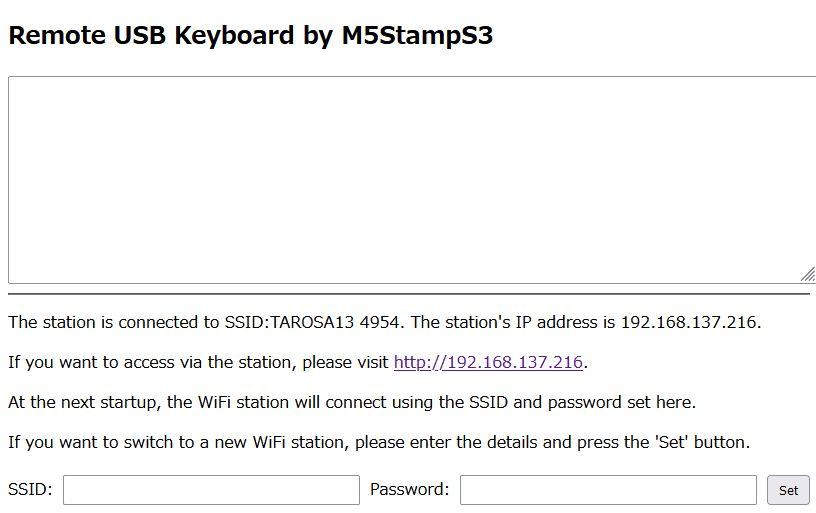

# Remote_Keyboard: USB Connected Network Key Input for Raspberry Pi and PC

# Remote_Keyboard
This is a program that connects via USB to a Raspberry Pi or PC and performs key input over the network.

## Required Devices

To use the Remote_Keyboard, you will need the following device:

- **M5StampS3**: This device is connected via USB to a Raspberry Pi or PC and acts as a remote keyboard over the network. The provided source code is specifically written for the M5StampS3 platform.

Make sure to have an M5StampS3 properly configured and connected to your Raspberry Pi or PC to get started with the Remote_Keyboard.

## Build Environment

The build for Remote_Keyboard was conducted using **Arduino IDE 2.3.2**. Follow the steps below to set up your environment:

### Board Selection

1. Install the **M5Stack board library**.
2. Select **M5StampS3 - M5Stack** from the board options.

### Libraries to Install

Make sure to install the following libraries using the Library Manager:

- **M5Stack by M5Stack**: [GitHub Repository](https://github.com/m5stack/m5stack)
- **AsyncTCP by dvarrel**: [GitHub Repository](https://github.com/dvarrel/AsyncTCP)
- **ESPAsyncWebServer by lacamera**: [GitHub Repository](https://github.com/lacamera/ESPAsyncWebServer)
- **Adafruit_NeoPixel by adafruit**: [GitHub Repository](https://github.com/adafruit/Adafruit_NeoPixel)

If any additional libraries are required, please install them as needed.

### Connecting M5StampS3 for Writing the Program

When writing the program to the M5StampS3, press and hold the button on the body of the M5StampS3 while connecting the USB cable to your computer. This will allow the device to enter the correct mode for programming.

## How to Use the Program

To use the Remote_Keyboard program, follow these steps:

1. **Connect the Device**: Connect the programmed **M5StampS3** (referred to as "Remote Keyboard" hereafter) to a Raspberry Pi or PC via USB.

2. **LED Indicators**: The Remote Keyboard has both Access Point mode (AP mode) and Station mode (STA mode). Upon startup, the LED will light up either red or green, indicating the current mode:

   - **Red LED**: When the LED is red, only the AP mode is active, indicating that it is waiting for a WiFi connection. The SSID will appear as **"Remote_Keyboard_http_192.168.4.1"** and can be connected without a password. After connecting, access **[http://192.168.4.1](http://192.168.4.1)** in your browser to open the Remote USB Keyboard interface.

   - **Green LED**: When the LED is green, both AP mode and STA mode are active, indicating it is waiting for a WiFi connection. Connect to the SSID **"Remote_Keyboard_http_192.168.4.1"** and access **[http://192.168.4.1](http://192.168.4.1)** in your browser. The Remote USB Keyboard interface will be displayed, along with the IP address of the Remote Keyboard connected in STA mode. By connecting to this IP address via HTTP, clients can use the keyboard over the LAN.

3. **Using the Remote Keyboard**: Once connected, you can start using the Remote Keyboard to input keys remotely through the network.

Follow these steps to set up and use the Remote_Keyboard program effectively on your Raspberry Pi or PC.

## Remote Keyboard Layout Type

The remote keyboard is mapped to a Japanese keyboard layout. When using it with a Raspberry Pi, please set the key layout to either "Japanese 106-key" or "Generic 104-key PC."

If you want to change the key layout, please modify the key mapping in the source code as needed.

## Setting Up SSID and Password for Station Mode

When you access the Remote USB Keyboard interface via HTTP, input fields for the SSID and password are displayed at the bottom of the screen. Follow these steps to set up the WiFi access point for STA mode:

1. **Enter SSID and Password**: In the input fields provided, enter the SSID and password of the WiFi access point you want the Remote Keyboard to connect to in STA mode.

2. **Save Settings**: Click the **"Set"** button. The SSID and password will be saved for future use.

3. **Next Startup**: Upon the next startup, the Remote Keyboard will attempt to connect to the saved SSID. If the connection is successful, the LED will light up in green.

4. **Find the Assigned IP Address**: After connecting successfully, you can find the IP address assigned by DHCP by accessing **[http://192.168.4.1](http://192.168.4.1)**.

5. **For Windows 11 Users**: If you connect the Remote Keyboard in STA mode to a mobile hotspot on Windows 11, you can also view the IP address of the Remote Keyboard in the mobile hotspot settings.

By following these steps, you can configure and connect the Remote Keyboard to your preferred WiFi network in STA mode.

## License

This program is licensed under the **MIT License**. Please note that each installed library follows its own respective license. Make sure to review and comply with the licenses of each library you use.
