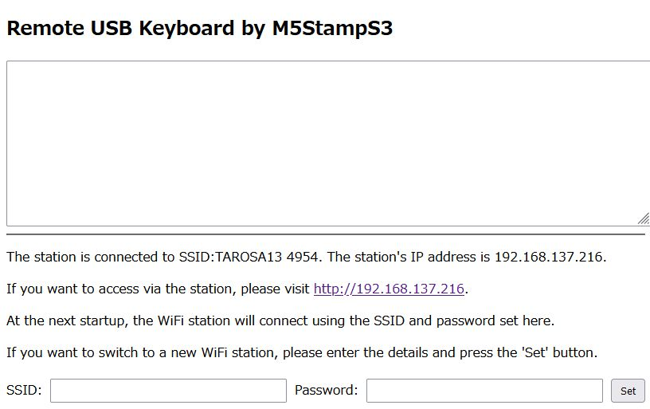

# Remote_Keyboard: Raspberry PiやPCにUSB接続し、ネットワーク経由でキー入力を行うプログラム

## Remote_Keyboardとは

このプログラムは、Raspberry PiやPCにUSB接続し、ネットワーク経由でキー入力を行うものです。

M5StampS3をキーボードデバイスとして使用するため「切手サイズの超小型キーボード」を実現しています。非常にコンパクトで持ち運びに便利なキーボードが提供されます。これにより、スペースが限られたセットアップや、最小限のスペースでの使用が求められるアプリケーションに最適です。

|  |  |
|:------------------------------------------:|:-------------------------------:|
| リモートキーボードの起動画面               | 切手サイズの M5StampS3          |

## 必要なデバイス

Remote_Keyboardを使用するためには、以下のデバイスが必要です。

- **M5StampS3**: このデバイスは、Raspberry PiやPCにUSBで接続され、ネットワーク経由でリモートキーボードとして動作します。提供されているソースコードは、M5StampS3プラットフォーム専用に書かれています。

Remote_Keyboardを使用するために、M5StampS3を正しく設定し、Raspberry PiやPCに接続してください。

## ビルド環境

Remote_Keyboardのビルドは、**Arduino IDE 2.3.2**を使用して行いました。以下の手順に従って環境をセットアップしてください。

### ボードの選択

1. **M5Stackボードライブラリ**をインストールします。
2. ボードのオプションから**M5StampS3 - M5Stack**を選択します。

### インストールするライブラリ

ライブラリマネージャーを使用して、以下のライブラリをインストールしてください。

- **M5Stack by M5Stack**: [GitHub リポジトリ](https://github.com/m5stack/m5stack)
- **ESP32TinyUSB by Dariuz Krempa**: [GitHub Repository](https://github.com/chegewara/EspTinyUSB)
- **AsyncTCP by dvarrel**: [GitHub リポジトリ](https://github.com/dvarrel/AsyncTCP)
- **ESPAsyncWebServer by lacamera**: [GitHub リポジトリ](https://github.com/lacamera/ESPAsyncWebServer)
- **Adafruit_NeoPixel by adafruit**: [GitHub リポジトリ](https://github.com/adafruit/Adafruit_NeoPixel)

他に必要なライブラリがある場合は、適宜インストールしてください。

### M5StampS3へのプログラム書き込み方法

M5StampS3にプログラムを書き込む際は、M5StampS3本体のボタンを押しながらUSBケーブルをコンピュータに接続してください。これにより、デバイスはプログラムの書き込みに適したモードに入ります。

## プログラムの利用方法

Remote_Keyboardプログラムを使用するには、以下の手順に従ってください。

1. **デバイスを接続する**: プログラムを書き込んだ**M5StampS3**（以下、「リモートキーボード」と記載）をUSBでRaspberry PiやPCに接続します。

2. **LEDインジケーター**: リモートキーボードは、アクセスポイントモード（APモード）とステーションモード（STAモード）の両方を持っています。起動時に、LEDが赤または緑に点灯し、現在のモードを示します。

   - **赤色LED**: LEDが赤色の場合、APモードのみがアクティブで、WiFi接続待機状態を示します。SSIDは**"Remote_Keyboard_http_192.168.4.1"**として表示され、パスワードなしで接続可能です。接続後、ブラウザで**[http://192.168.4.1](http://192.168.4.1)**にアクセスすると、リモートUSBキーボードのインターフェースが表示されます。

   - **緑色LED**: LEDが緑色の場合、APモードとSTAモードの両方がアクティブで、WiFi接続待機状態を示します。SSID **"Remote_Keyboard_http_192.168.4.1"**に接続し、ブラウザで**[http://192.168.4.1](http://192.168.4.1)**にアクセスすると、リモートUSBキーボードのインターフェースと、STAモードで接続しているリモートキーボードのIPアドレスが表示されます。このIPアドレスにHTTP接続することで、クライアントはLAN経由でキーボードを使用できます。

3. **リモートキーボードの使用**: 接続後、リモートキーボードを使用してネットワーク経由でキー入力を行うことができます。

これらの手順に従い、Remote_Keyboardプログラムを効果的にセットアップし、Raspberry PiやPCで使用してください。

## リモートキーボードのレイアウトタイプ

リモートキーボードは、日本語キーボードのキーマッピングとなっています。Raspberry Piで使用する場合は、「Japanese 106-key」または「Generic 104-key PC」のキーレイアウトを設定してください。

キーレイアウトを変更したい場合は、キーマッピングのソースコードを適宜修正してください。

## ステーションモードのSSIDとパスワードの設定方法

リモートUSBキーボードのインターフェースにHTTP接続すると、画面の下部にSSIDとパスワードの入力欄が表示されます。STAモードでWiFiアクセスポイントを設定するには、以下の手順に従ってください。

1. **SSIDとパスワードを入力**: 提供された入力欄に、リモートキーボードがSTAモードで接続するWiFiアクセスポイントのSSIDとパスワードを入力します。

2. **設定を保存**: **「Set」**ボタンをクリックします。SSIDとパスワードが今後の使用のために保存されます。

3. **次回の起動時**: 次回の起動時に、リモートキーボードは保存されたSSIDに接続を試みます。接続が成功すると、LEDが緑色に点灯します。

4. **割り当てられたIPアドレスを確認**: 接続後、**[http://192.168.4.1](http://192.168.4.1)**にアクセスすると、DHCPから割り当てられたIPアドレスを確認できます。

5. **Windows 11ユーザーの場合**: Windows 11でモバイルホットスポットにSTAモードでリモートキーボードを接続すると、モバイルホットスポットの設定でリモートキーボードのIPアドレスを確認することもできます。

これらの手順に従うことで、リモートキーボードを希望するWiFiネットワークにSTAモードで設定し、接続することができます。

## ライセンスについて

本プログラムは**MITライセンス**のもとで公開されています。インストールした各ライブラリのライセンスは、そのライブラリのライセンスに従います。各ライブラリのライセンスを確認し、それに従ってください。
